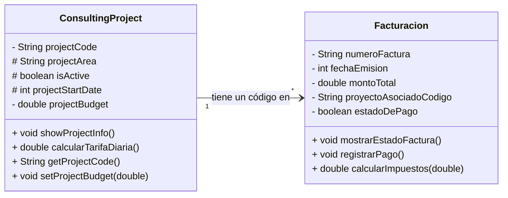

# Semana 1 Consultoría Empresarial "Soluciones Estratégicas"

# Análisis Orientado a Objetos - Consultoría Empresarial

## 1. Identificación del Dominio

* **Nombre del negocio:** Soluciones Estratégicas
* **Tipo:** Consultoría Empresarial
* **Descripción:** Empresa que ofrece servicios especializados a clientes corporativos a través de proyectos definidos (Marketing, Logística, Finanzas) y genera documentación legal y financiera.

---

## 2. Objetos Identificados

### Objeto Principal: ProyectoConsultoria (ConsultingProject)
* **¿Qué es?:** El servicio o tipo de trabajo que "Soluciones Estratégicas" ofrece a un cliente. Es la unidad central de ingresos y gestión.
* **Atributos identificados:**
    * codigoProyecto: String - Código identificador único del proyecto (ej: MKT-001).
    * areaProyecto: String - Área de especialización del proyecto (ej: Marketing, Logística).
    * estaActivo: boolean - Indica si el proyecto se encuentra en ejecución (`true`) o finalizado (`false`).
    * anioInicioProyecto: int - Año de inicio del proyecto (usado para antigüedad, no como fecha completa).
    * presupuestoProyecto: double - Monto total que el cliente debe pagar por el proyecto.
* **Métodos identificados:**
    * mostrarInformacionProyecto(): Muestra todos los detalles del proyecto en consola.
    * calcularTarifaDiariaEstimada(): Calcula y retorna el costo promedio por día del proyecto.
    * getCodigoProyecto(): Retorna el código identificador del proyecto.
    * setPresupuestoProyecto(double nuevoPresupuesto): Permite modificar el presupuesto asignado al proyecto.

### Objeto Secundario: Factura (Billing)
* **¿Qué es?:** El documento legal y financiero generado por la empresa para registrar la transacción de dinero relacionada con un proyecto.
* **Atributos identificados:**
    * numeroFactura: String - Número de identificación único de la factura (ej: FACT-001).
    * fechaEmision: int - Fecha en la que se generó la factura (YYYYMMDD).
    * montoTotal: double - Valor total a cobrar/pagar en esa factura.
    * codigoProyectoRelacionado: String - El código del proyecto al que se le está cobrando.
    * estadoPago: boolean - Indica si el cliente ya pagó (`true`) o si el estado está pendiente (`false`).
* **Métodos identificados:**
    * mostrarEstadoFactura(): Imprime los detalles y el estado de pago (PAGADA/PENDIENTE) en consola.
    * registrarPago(): Cambia el atributo `estadoPago` a `true` cuando se confirma la recepción del dinero.
    * calcularImpuestos(double tasaImpuestos): Calcula y retorna el monto de los impuestos aplicando una tasa al `montoTotal`.

---

## 3. Relación entre Objetos

* **Tipo de relación:** Asociación (Uno a Muchos Conceptual)
* **Descripción:** Un Proyecto de Consultoría (**`ProyectoConsultoria`**) puede generar varias **`Facturas`** a lo largo de su ejecución (por ejemplo, pagos por hitos). La `Factura` utiliza el atributo **`codigoProyectoRelacionado`** para establecer esta asociación con el proyecto específico al que se refiere el cobro.

---

## 4. Justificación del Diseño

* **¿Por qué elegí estos objetos?**
    Porque el Proyecto es el centro de las operaciones (lo que se vende y se ejecuta) y la Facturación es el centro de las finanzas (lo que genera ingresos). Son las dos entidades esenciales para que el negocio funcione y se mantenga legalmente.
* **¿Por qué estos atributos son importantes?**
    Los atributos definidos son los datos mínimos y esenciales para identificar, rastrear y valorar financieramente el trabajo. Por ejemplo, `codigoProyecto` permite la trazabilidad; `presupuestoProyecto` y `montoTotal` permiten el cálculo de ingresos; y `estaActivo`/`estadoPago` permiten el control del flujo de trabajo y cobranza.
* **¿Por qué estos métodos son necesarios?**
    Los métodos representan la lógica de negocio: **Cálculo** (para decisiones financieras), y **Gestión de Estado** (para que los objetos cambien su estado en el tiempo, como de pendiente a pagada).

## 5. Diferencias entre programación estructurada y POO

Ambos son paradigmas que definen cómo se estructura el código. La **Programación Estructurada** se enfoca en la ejecución de pasos lógicos de forma secuencial. Su estructura se basa en **funciones** y el uso de **variables globales** que pueden cambiarse libremente. El problema es que, en proyectos grandes, la separación de los datos y la lógica hace que el código sea difícil de escalar y mantener.

La **Programación Orientada a Objetos** surgió para resolver esto. Se enfoca en modelar entidades del mundo real que son los objetos. Su concepto central consiste en agrupar los datos (atributos) y las acciones (métodos) en una sola unidad llamada **Clase**, algo que se le denomina **Encapsulamiento**. La POO utiliza los conceptos de la Programación Estructurada (como los bucles y condicionales) internamente, pero aporta una capa de **modularidad** lo que hace el código más legible y robusto.

### Ejemplo conceptual de cómo se manejaría la información de un proyecto en PE y POO:
#### PE Facturación:

```java
public class ProjectStructuredPE {
    // Datos del primer proyecto
    static String codigoProyecto1 = "PROJECT-001";
    static String areaProyecto1 = "Planeación Estratégica";
    static double presupuestoProyecto1 = 5000.00;

    // Datos del segundo proyecto
    static String codigoProyecto2 = "PROJECT-002";
    static String areaProyecto2 = "Análisis Financiero";
    static double presupuestoProyecto2 = 3500.00;

    public static void mostrarInfoProyecto(String codigo, String area, double presupuesto) {
            System.out.println("\n--- PROYECTO ---");
            System.out.println("Código: " + codigo);
            System.out.println("Área: " + area);
            System.out.println("Presupuesto: $" + presupuesto);
        }

        public static void main(String[] args) {
            
            System.out.println("--- Ejemplo Programación Estructurada ---");
            mostrarInfoProyecto(codigoProyecto1, areaProyecto1, presupuestoProyecto1);
            mostrarInfoProyecto(codigoProyecto2, areaProyecto2, presupuestoProyecto2);
        }
    }
```
#### POO Facturación:

``` java
public class ConsultingProject {

    String projectCode;
    String projectArea;
    double projectBudget;

    public ConsultingProject(String code, String area, double budget) {
        this.projectCode = code;
        this.projectArea = area;
        this.projectBudget = budget;
    }

    public void showProjectInfo() {
        System.out.println("--- Project POO ---");
        System.out.println("Project's code: " + this.projectCode);
        System.out.println("Project's area: " + this.projectArea);
        System.out.println("Project's budget: $" + this.projectBudget);
    }
}

public class Main {
    public static void main (String[] args){
    ConsultingProject firstProject = new ConsultingProject("PROJECT-001", "Finanzas", 5000.00);
    ConsultingProject secondProject = new ConsultingProject("PROJECT-002", "Administracion", 3500.00);
    firstProject.showProjectInfo();
    secondProject.showProjectInfo();

    }
}
```

### 2. 📉 Diagrama de Clases

