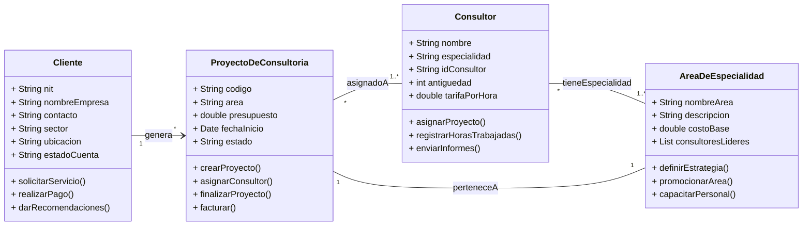

# Semana 1 Consultoría Empresarial "Soluciones Estratégicas"

Esta es la Actividad 1 de la Semana 1. He identificado los objetos claves de la Consultoría Empresarial "Soluciones Estratégicas". Cada objeto se presenta con su definición, sus características (atributos) y sus comportamientos (métodos).

## Actividad 1: Identificación de Objetos

### Objeto 1: Consultor

**¿Qué es?**
Una persona especializada contratada para ejecutar y asesorar proyectos con los clientes de la firma "Soluciones Estratégicas".

**Características (Atributos):**
* nombre
* especialidad
* idConsultor
* antigüedad
* tarifaPorHora

**Comportamientos (Métodos):**
* asignarProyecto()
* registrarHorasTrabajadas()
* enviarInformes()

---

### Objeto 2: Cliente (Empresa)

**¿Qué es?**
La empresa que contrata los servicios de la consultoría Empresarial "Soluciones Estratégicas".

**Características (Atributos):**
* nit
* nombreEmpresa
* contacto
* sector
* ubicación
* estadoCuenta

**Comportamientos (Métodos):**
* solicitarServicio()
* realizarPago()
* darRecomendaciones()

### Objeto 3: Proyecto de Consultoría

**¿Qué es?**
El servicio o tipo de trabajo que "Soluciones Estratégicas" ofrece al cliente.

**Características (Atributos):**
* código
* √°rea
* presupuesto
* fechaInicio
* estado

**Comportamientos (Métodos):**
* crearProyecto()
* asignarConsultor()
* finalizarProyecto()
* facturar()

---

### Objeto 4: Área de Especialidad

**¿Qué es?**
El tipo de área de especialización que ofrece "Soluciones Estratégicas" o que la empresa cliente requiere para el proyecto de consultoría.

**Características (Atributos):**
* nombreArea
* descripción
* costoBase
* consultoresLíderes

**Comportamientos (Métodos):**
* definirEstrategia()
* promocionarÁrea()
* capacitarPersonal()

---

### Objeto 5: Facturación

**¿Qué es?**
Documento legal y financiero que genera la empresa por la transacción de dinero de cada proyecto de consultoría. Es una parte primordial de la contabilidad y finanzas.

**Características (Atributos):**
* numeroFactura
* fechaEmisión
* montoTotal
* proyectoAsociado
* estadoDePago

**Comportamientos (Métodos):**
* calcularImpuestos()
* registrarPago()
* consultarEstadoPago()
* envíoEmail()
---
### üìâ Diagrama de Clases (UML)

```mermaid
classDiagram
    direction LR

    %% Definición de Clases
    class Consultor {
        + String nombre
        + String especialidad
        + String idConsultor
        + int antiguedad
        + double tarifaPorHora
        + asignarProyecto()
        + registrarHorasTrabajadas()
        + enviarInformes()
    }

    class Cliente {
        + String nit
        + String nombreEmpresa
        + String contacto
        + String sector
        + String ubicacion
        + String estadoCuenta
        + solicitarServicio()
        + realizarPago()
        + darRecomendaciones()
    }

    class ProyectoDeConsultoria {
        + String codigo
        + String area
        + double presupuesto
        + Date fechaInicio
        + String estado
        + crearProyecto()
        + asignarConsultor()
        + finalizarProyecto()
        + facturar()
    }

    class AreaDeEspecialidad {
        + String nombreArea
        + String descripcion
        + double costoBase
        + List<Consultor> consultoresLideres
        + definirEstrategia()
        + promocionarArea()
        + capacitarPersonal()
    }

    %% Relaciones de Asociación
    Cliente "1" --> "*" ProyectoDeConsultoria : genera
    ProyectoDeConsultoria "*" -- "1..*" Consultor : asignadoA
    Consultor "*" -- "1..*" AreaDeEspecialidad : tieneEspecialidad
    ProyectoDeConsultoria "1" -- "1" AreaDeEspecialidad : perteneceA

```
## 2. Dificultades Encontradas
Al realizar la identificacion de los objetos de la consultoria he identificado deficiencias en la relacion o conocimento acerca del tipo de proyecto. No conozco realmente que proceso hace la consultoria, mi conocimiento acerca de esto era casi nulo y tuve que recurrrir a herramientas de apoyo para generar contexto y al menos unas buenas bases para poder hacer la actividad de la mejor manera.
Esto genero en mi poca motivacion y con ayuda de la IA conoci que aspectos, cualidades, y metodos puede contener cadas objeto y que pudiera ser cercano o funcional con base a las directrices de la consultoria.

## 3. Decisiones de Diseño
**¿Por qué elegí estos atributos?**
Principalmente porque se me hicieron que iban acorde al objeto en si, obviamente, sin dejar de lado que son basicos o no tan complicados lo que permite que en las proximas actividades pueda desenvolverme mejor, sin tanta complicacion.

**¿Qué validaciones implementé?**
Implente validaciones con la IA y con diferentes paginas web donde pueda entender realmente las acciones y cargos de una empresa con este objetivo. Con criterio, comprendi las metas de este tipo de empresas y los actores que se desenvuelven en estas areas.

