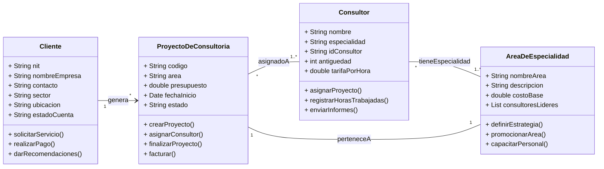

# Semana 1 Consultoría Empresarial "Soluciones Estratégicas"

Esta es la Actividad 1 de la Semana 1. He identificado los objetos claves de la Consultoría Empresarial "Soluciones Estratégicas". Cada objeto se presenta con su definición, sus características (atributos) y sus comportamientos (métodos).

## Actividad: Identificación de Objetos

### Objeto 1: Consultor

**¿Qué es?**
Una persona especializada contratada para ejecutar y asesorar proyectos con los clientes de la firma "Soluciones Estratégicas".

**Características (Atributos):**
* nombre
* especialidad
* idConsultor
* antigüedad
* tarifaPorHora

**Comportamientos (Métodos):**
* asignarProyecto()
* registrarHorasTrabajadas()
* enviarInformes()

---

### Objeto 2: Cliente (Empresa)

**¿Qué es?**
La empresa que contrata los servicios de la consultoría Empresarial "Soluciones Estratégicas".

**Características (Atributos):**
* nit
* nombreEmpresa
* contacto
* sector
* ubicación
* estadoCuenta

**Comportamientos (Métodos):**
* solicitarServicio()
* realizarPago()
* darRecomendaciones()


### Objeto 3: Proyecto de Consultoría

**¿Qué es?**
El servicio o tipo de trabajo que "Soluciones Estratégicas" ofrece al cliente.

**Características (Atributos):**
* código
* área
* presupuesto
* fechaInicio
* estado

**Comportamientos (Métodos):**
* crearProyecto()
* asignarConsultor()
* finalizarProyecto()
* facturar()

---

### Objeto 4: Área de Especialidad

**¿Qué es?**
El tipo de área de especialización que ofrece "Soluciones Estratégicas" o que la empresa cliente requiere para el proyecto de consultoría.

**Características (Atributos):**
* nombreArea
* descripción
* costoBase
* consultoresLíderes

**Comportamientos (Métodos):**
* definirEstrategia()
* promocionarÁrea()
* capacitarPersonal()

---

### Objeto 5: Facturación

**¿Qué es?**
Documento legal y financiero que genera la empresa por la transacción de dinero de cada proyecto de consultoría. Es una parte primordial de la contabilidad y finanzas.

**Características (Atributos):**
* numeroFactura
* fechaEmisión
* montoTotal
* proyectoAsociado
* estadoDePago

**Comportamientos (Métodos):**
* calcularImpuestos()
* registrarPago()
* consultarEstadoPago()
* envíoEmail()

## 3. Dificultades Encontradas
Al realizar la identificacion de los objetos de la consultoria he identificado deficiencias en la relacion o conocimento acerca del tipo de proyecto. No conozco realmente que proceso hace la consultoria, mi conocimiento acerca de esto era casi nulo y tuve que recurrrir a herramientas de apoyo para generar contexto y al menos unas buenas bases para poder hacer la actividad de la mejor manera.
Esto genero en mi poca motivacion y con ayuda de la IA conoci que aspectos, cualidades, y metodos puede contener cadas objeto y que pudiera ser cercano o funcional con base a las directrices de la consultoria.


## 4. Decisiones de Diseño
- **¿Por qué elegí estos atributos?**
Principalmente porque se me hicieron que iban acorde al objeto en si, obviamente, sin dejar de lado que son basicos o no tan complicados lo que permite que en las proximas actividades pueda desenvolverme mejor, sin tanta complicacion.

- **¿Qué validaciones implementé?**
Implente validaciones con la IA y con diferentes paginas web donde pueda entender realmente las acciones y cargos de una empresa con este objetivo. Con criterio, comprendi las metas de este tipo de empresas y los actores que se desenvuelven en estas areas.

## Comparacion Programación Orientada a Objetos (POO) vs Programación Estructurada (PE)

### Diferencias entre programación estructurada y POO

Ambos son paradigmas que definen cómo se estructura el código. La Programación Estructurada se enfoca la ejecucion de pasos logicos acerca de x cosa. Su estructura se basa en funciones y el uso de variables globales que puedes cambiar mientras se avanza. El problema de la Programacion Estructurada es que, en proyectos grandes, la separación de los datos y la lógica hace que el código sea difícil de escalar y mantener.

La Programación Orientada a Objetos surgió para resolver esto. Se enfoca en modelar entidades del mundo real que son los objetos. Su concepto central consiste en agrupar los datos (atributos) y las acciones (métodos) en una sola unidad llamada Clase algo que se le denomina Encapsulameiento. La POO utiliza los conceptos de la Programacion Estructurada (como los bucles y condicionales) internamente, pero aporta una capa de modularidad lo que significa que nos permite separar el codigo en modulos o partes y que hace el código más legible y robusto.

### Ejemplo conceptual de cómo se manejaría la información de un proyecto en PE y POO:
#### PE Facturación:

```
public class ProjectStructuredPE {
    //first project data
    static String projectCode1 = "PROJECT-001";
    static String projectArea1 = "Planeación Estratégica";
    static double projectBudget1 = 5000.00;

    //Second data project
    static String projectCode2 = "PROJECT-002";
    static String projectArea2 = "Análisis Financiero";
    static double projectBudget2 = 3500.00;

    public static void showProjectInfo(String code, String area, double budget) {
            System.out.println("\n--- PROJECT ---");
            System.out.println("Project's code: " + code);
            System.out.println("Project's area: " + area);
            System.out.println("Project's budget: $" + budget);
        }

        public static void main(String[] args) {
            
            System.out.println("--- Structured Programming example ---");
            showProjectInfo(projectCode1, projectArea1, projectBudget1);
            showProjectInfo(projectCode2, projectArea2, projectBudget2);
        }
    }


```
#### POO Facturación:

```
public class ConsultingProject {

    String projectCode;
    String projectArea;
    double projectBudget;

    public ConsultingProject(String code, String area, double budget) {
        this.projectCode = code;
        this.projectArea = area;
        this.projectBudget = budget;
    }

    public void showProjectInfo() {
        System.out.println("--- Project POO ---");
        System.out.println("Project's code: " + this.projectCode);
        System.out.println("Project's area: " + this.projectArea);
        System.out.println("Project's budget: $" + this.projectBudget);
    }
}

public class Main {
    public static void main (String[] args){
    ConsultingProject firstProject = new ConsultingProject("PROJECT-001", "Finanzas", 5000.00);
    ConsultingProject secondProject = new ConsultingProject("PROJECT-002", "Administracion", 3500.00);
    firstProject.showProjectInfo();
    secondProject.showProjectInfo();

    }
}
```
---
### 2. 📉 Diagrama de Clases (UML)

